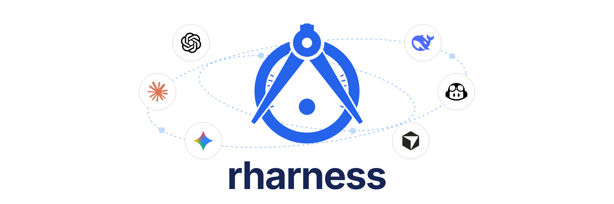

# rharness

<p align="center"></p>
<p align="center"><sub>Cover made with the rharness <code>figures</code> plugin.</sub></p>

<p align="center">
  <a href="https://github.com/Vein05/rharness/actions/workflows/ci.yml"></a>
  <a href="https://github.com/Vein05/rharness/releases"></a>
  
  
  
  <a href="LICENSE"></a>
</p>

rharness is an opinionated research harness for ML and NLP work done with
coding agents. One command gives you a workspace where every paper project
has a contract the agent must obey, a record of every session, and a lint
that tells you when the two drift apart. It is markdown and small scripts,
not an app: the agent reads the files, you edit them, git tracks them.

## The opinions

These are not defaults you configure. They are the product. Also at
[vein05.github.io/rharness](https://vein05.github.io/rharness/#opinions).

1. **A kill criterion before any spend.** Every project starts with
   `CHARTER.md`: the core question, the result that means the paper exists,
   and the result that means stop.
2. **Spec before code.** The headline table is designed in `spec/scoring.md`
   before a single number exists, with its control row and its ceiling row.
   Code without a spec is a probe and never produces a paper number.
3. **Never rewrite history.** Handoffs, changelogs, and experiment reports
   are dated and append-only. Corrections are added on top with a date.
4. **Every number traces to a scorer version and a run.** Rounded values
   are never copied between documents.
5. **Manual audit before belief.** A detector's first output is never
   reported. Read the hits, spot-check every category, check traces.
6. **Authoritative versus historical.** Each project's `AGENTS.md` says
   which documents are current and which are dated records.
7. **Absolute dates only.** Never "last Thursday" in a persistent file.
8. **One agent entry point.** `AGENTS.md` is the source of truth for Claude
   Code, Codex, and any collaborator. `CLAUDE.md` is a one-line include.
9. **Prose passes the three-reader test.** A strong student, a PhD student,
   and a senior scientist must all get the result on one pass.
10. **Drift is measured, not assumed.** `rharness lint` checks every rule
    above that a script can check, and exits nonzero when one fails.

## Quickstart

Install. Requires `python3` 3.9 or newer, `git`, and `tar`; `git-lfs` is
recommended. The installer downloads the release tarball and its
`SHA256SUMS` from GitHub Releases and refuses to install on a mismatch.

```sh
curl -fsSL https://raw.githubusercontent.com/Vein05/rharness/main/install.sh | sh
```

Create a workspace. This writes the root `AGENTS.md`, a `CLAUDE.md` include,
lint thresholds, and installs the default `rtk` plugin.

```sh
rharness init ~/research
```
```
Created workspace at /Users/you/research
  wrote AGENTS.md
  wrote CLAUDE.md
  wrote lint.toml
Installed plugin rtk
  wrote .rharness/hooks/rtk-rewrite.sh
Next: rharness new <slug>   (inside the workspace)
```

Start a paper project. Run it from anywhere inside the workspace.

```sh
cd ~/research
rharness new seam --title "Paste-boundary instruction absorption"
```
```
  wrote seam/CHARTER.md
  wrote seam/AGENTS.md
  wrote seam/spec/scoring.md
  wrote seam/paper/writing.md
  ... 19 files
Created project seam at /Users/you/research/seam
Next: fill in CHARTER.md (kill criterion first), then spec/scoring.md
```

You now have:

```
research/
  AGENTS.md            orientation, project table, the cross-cutting rules
  CLAUDE.md            @AGENTS.md
  lint.toml            lint thresholds
  .rharness/           manifest, doc archetypes, hook scripts
  .claude/             hooks and skills (Claude Code only)
  seam/                a git repo with LFS rules
    CHARTER.md         core question, success criterion, kill criterion
    AGENTS.md          repo map, known traps, standing rules
    spec/scoring.md    the headline table, designed before any run
    research/          the knowledge base; one archetype per document
    paper/writing.md   the prose rules the paper and living docs follow
    handoff/           one file per session, dated
    changelog/         one file per day, append-only
    data/ papers/ tests/ tools/
```

Open `seam/CHARTER.md` with your agent and fill in the kill criterion first.
The agent has already read `AGENTS.md`, so it knows the rules. Then write
`spec/scoring.md`. Then the first research document, usually a novelty scan;
the eleven document skeletons are in `.rharness/archetypes/`.

Every session starts oriented. `rharness brief` prints the charter status,
the newest handoff, the last changelog entry, the authoritative documents,
and open lint findings for the project you are in. In Claude Code this runs
automatically at session start, and a Stop hook refuses to let a session end
on a day with commits but no handoff and changelog.

```sh
rharness brief seam
```
```
# Brief: seam (Paste-boundary instruction absorption) — 2026-09-12

## Charter
Core question: Do models fold a trailing remark into the pasted document?
Success criterion: NOT YET
Kill criterion: NOT TRIGGERED (stop if recall < 0.5 on the held-out split)

## Newest handoff: handoff/2026-09-11.md
...
```

When a trace or scored file is frozen, record it. Every number in the paper
should point at a row in `research/PROVENANCE.md`, and lint fails if a
recorded file changes or disappears.

```sh
rharness hash traces/run-v2-full.jsonl --note "Table 1 rows 1-3"
```

Check the workspace whenever you like. Lint exits 1 when anything fails, so
it works in a pre-commit hook or a cron job. It checks structure and the
contract fields it can read: that the kill criterion states a threshold,
that the scoring spec keeps its control and ceiling rows, that code has a
spec, that recorded artifacts are unchanged. It does not judge the science.

```sh
rharness lint
```
```
error seam/CHARTER.md: kill criterion states no threshold; the section has only a Status line
error seam/traces/run-v2-full.jsonl: traces/run-v2-full.jsonl changed since it was recorded (2026-09-11, 8746a9ae0dc60310); re-run `rharness hash` and re-check every number that cites it
warning seam/spec/: 4 source file(s) but no component spec in spec/ besides scoring.md; code without a spec is a probe
warning seam/handoff/: newest handoff 2026-09-09 is 3 days older than newest commit 2026-09-12
Summary: 2 errors, 2 warnings
```

Check the machine. This is also what catches a silently dropped hook.

```sh
rharness doctor
```
```
ok   python >= 3.9: 3.12.4
ok   git on PATH: /opt/homebrew/bin/git
ok   git-lfs on PATH: /opt/homebrew/bin/git-lfs
ok   workspace manifest: /Users/you/research/.rharness/manifest.json
ok   rtk binary on PATH: /opt/homebrew/bin/rtk
ok   rtk hook registered: /Users/you/research/.claude/settings.json
```

## Already have a research folder?

`adopt` adds what is missing and never overwrites what exists. Your files
are recorded as yours, so later updates leave them alone.

```sh
rharness adopt ~/research              # a folder of paper projects
rharness adopt ~/research/old-paper    # one project
rharness --dry-run adopt ~/research    # see what it would add first
```

A project is any subdirectory with a `CHARTER.md`, an `AGENTS.md`, or a
`.git`. Adopting a directory that is not a git repo initialises one, so read
the dry run before adopting a folder you have not looked at in a while.

## Plugins

Plugins are opt-in packs of markdown guidance, and sometimes a helper or a
hook, written into a workspace and its projects. Installing one inserts a
section into `AGENTS.md`, so the agent follows its rules from the next
session on.

| Plugin | Added to | What it gives you | Needs | Default |
|---|---|---|---|:---:|
| [rtk](plugins/rtk/) | Workspace | Token-saving command proxy for Claude Code, registered as a hook; [official project](https://github.com/rtk-ai/rtk) | `rtk`, `jq` (installed by `setup.sh` if missing) | Yes |
| [figures](plugins/figures/) | Workspace | SVG-first figure pipeline: style guide, geometry checker, icon fetcher, matplotlib style | `rsvg-convert`, `pdffonts`, Pillow | No |
| [review-panel](plugins/review-panel/) | Workspace | Runs your paper through panels of LLM reviewers at multiple model tiers, with a holdout canary and hard spend ceiling | `OPENROUTER_API_KEY`, `pdftotext`, `pip install openai pyyaml` | No |
| [wandb](plugins/wandb/) | Workspace + projects | Weights & Biases tracking rules and a run initialiser in every project | `WANDB_API_KEY`, `pip install wandb` | No |
| [ideas](plugins/ideas/) | Workspace | Ranked ideas backlog with novelty-scan dates and a dead-cells list | nothing | No |

```sh
rharness add figures                                  # built in, no prompt
rharness add alice/research-plugins/plugins/x         # from GitHub: owner/repo[/subdir]
rharness add alice/research-plugins/plugins/x@v1.2    # pinned to a tag, branch, or commit
rharness add ~/code/my-plugin                         # from a local directory
rharness list                                         # origin, status, source, commit
```

Installing a plugin from outside the release means trusting that code on
your machine: it can add rules the agent will follow, register Claude Code
hooks, and run a setup script. So `add` first prints what the plugin would
do, including every hook command, and asks before proceeding. Pass `--yes`
to accept non-interactively. Built-in plugins ship with the release and
install without a prompt. `add` also prints any environment variable or
binary the plugin needs that your shell does not have.

Write your own with `rharness plugin new my-plugin`, which scaffolds the
directory with a README explaining how to publish it. The full format, the
rules a plugin must respect, and the publish flow are in
[docs/plugins.md](docs/plugins.md).

## How updates work

Every file rharness writes is recorded with a hash in
`.rharness/manifest.json`. `rharness update` fetches the latest release and
replaces a file only if it still matches its recorded hash; a file you
edited is kept and a diff is printed. In `AGENTS.md` and `paper/writing.md`
rharness owns only the text between `<!-- rharness:begin ... -->` and
`<!-- rharness:end ... -->` markers. Everything outside them is yours.

## Command reference

| Command | What it does |
|---|---|
| `rharness init [dir]` | Create a workspace and install the default plugins |
| `rharness new <slug> [--title T]` | Scaffold a paper project inside the workspace |
| `rharness adopt [dir] [--projects a,b]` | Retrofit an existing workspace or project without overwriting |
| `rharness brief [project]` | Orientation for a fresh session: charter, handoff, changelog, authoritative docs, lint |
| `rharness hash <paths> [--note T]` | Record frozen artifacts in `research/PROVENANCE.md` |
| `rharness add <plugin> [--refresh]` | Install a plugin: built-in name, local path, git URL, or `owner/repo[/subdir][@ref]`; external sources ask first, `--yes` accepts |
| `rharness remove <plugin>` | Uninstall a plugin; modified files are kept and listed |
| `rharness list` | Plugins with origin, install status, and source |
| `rharness plugin new <name> [--dir D]` | Scaffold a plugin directory |
| `rharness lint [dir] [--json]` | Check projects against the rules; exit 1 on findings |
| `rharness doctor` | Check python, git, git-lfs, rtk, and hook registration |
| `rharness update [--no-fetch] [--force]` | Fetch the latest release, verify it against `SHA256SUMS`, re-apply managed files |
| `rharness session-check` | Behind the Claude Code Stop hook: today's work needs today's handoff and changelog |
| `rharness version` | Print the installed version |

Global flags: `--workspace <dir>` to skip discovery, `--dry-run` to print
without writing.

## Development

```sh
python3 -m pytest -q
```

Design: [docs/superpowers/specs/2026-09-09-rharness-design.md](docs/superpowers/specs/2026-09-09-rharness-design.md).
Cover: `assets/cover/build.py` generates `assets/cover.svg`; `assets/cover-social.png` is the 1280x640 social preview.
