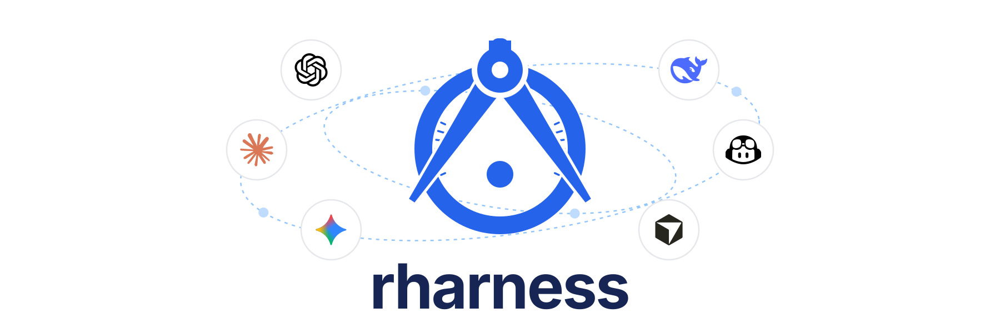

# rharness

<p align="center"></p>
<p align="center"><sub>Cover made with the rharness <code>figures</code> plugin.</sub></p>

<p align="center">
  <a href="https://github.com/Vein05/rharness/actions/workflows/ci.yml"></a>
  <a href="https://github.com/Vein05/rharness/releases"></a>
  
  
  
  <a href="LICENSE"></a>
</p>

rharness (research harness) sets up ML and NLP paper projects for work with
coding agents. Each project gets a contract the agent follows, a record of
every session, and a lint that tells you when the two drift apart. It is
plain markdown and small scripts: the agent reads the files, you edit them,
git tracks them.

## The opinions

These are the product, not settings. Also at
[vein05.github.io/rharness](https://vein05.github.io/rharness/#opinions).

1. **A kill criterion before any spend.** Every project starts with
   `CHARTER.md`: the core question, the result that means the paper exists,
   and the result that means stop.
2. **Spec before code.** The headline table is designed in `spec/scoring.md`
   before a single number exists, with its control row and its ceiling row.
   Code without a spec is a probe and never produces a paper number.
3. **Never rewrite history.** Handoffs, changelogs, and experiment reports
   are dated and append-only. Corrections are added on top with a date.
4. **Every number traces to a scorer version and a run.** Rounded values
   are never copied between documents.
5. **Manual audit before belief.** A detector's first output is never
   reported. Read the hits, spot-check every category, check traces.
6. **Authoritative versus historical.** Each project's `AGENTS.md` says
   which documents are current and which are dated records.
7. **Absolute dates only.** Never "last Thursday" in a persistent file.
8. **One agent entry point.** `AGENTS.md` is the source of truth for Claude
   Code, Codex, and any collaborator. `CLAUDE.md` is a one-line include.
9. **Prose passes the three-reader test.** A strong student, a PhD student,
   and a senior scientist must all get the result on one pass.
10. **Drift is measured, not assumed.** `rharness lint` checks every rule
    above that a script can check, and exits nonzero when one fails.

## Quickstart

Needs Python 3.9+, git, and tar (git-lfs recommended). The installer checks
the download against its published checksum.

```sh
curl -fsSL https://raw.githubusercontent.com/Vein05/rharness/main/install.sh | sh
rharness init ~/research          # the workspace
cd ~/research
rharness new seam --title "Paste-boundary instruction absorption"
```

That gives you:

```
research/
  AGENTS.md            rules and the project table; CLAUDE.md includes it
  lint.toml            lint settings
  seam/                a git repo
    CHARTER.md         core question, success criterion, kill criterion
    AGENTS.md          repo map, known traps, standing rules
    spec/scoring.md    the headline table, designed before any run
    research/          notes, one document type per file
    paper/             main.tex, references.bib, writing rules
    handoff/           one file per session, dated
    changelog/         one file per day, append-only
```

Open `seam/CHARTER.md` with your agent and write the kill criterion first,
then `spec/scoring.md`.

## Daily use

```sh
rharness brief          # where things stand: charter, newest handoff, changelog, lint
rharness hash traces/run-v2.jsonl --note "Table 1"   # freeze a result file
rharness lint           # check the rules; exits 1 on findings
rharness doctor         # check the machine and hooks
```

In Claude Code, `brief` runs at session start, and a Stop hook won't let a
session end on a day with work but no handoff or changelog entry.

`lint` checks what a script can check: the kill criterion has a threshold,
the scoring spec has control and ceiling rows, code has a spec, frozen files
are unchanged, the bibliography is clean, and the files a new session reads
are short enough. It does not judge the science.

```
error seam/CHARTER.md: kill criterion states no threshold; the section has only a Status line
error seam/traces/run-v2.jsonl: traces/run-v2.jsonl changed since it was recorded (2026-09-11, 8746a9ae0dc60310); re-run `rharness hash` and re-check every number that cites it
warning seam/handoff/: newest handoff 2026-09-09 is 3 days older than newest commit 2026-09-12
Summary: 2 errors, 1 warnings
```

Set `fail_on = "error"` in `lint.toml` to fail only on errors.

## Venues

Attach a submission target and lint checks the paper against it: page
limit, required sections, citations, style file, and anonymity.

```sh
rharness venue add iclr 2027
rharness venue              # deadlines and current findings
rharness venue lock         # once the paper is committed to this venue
rharness paper build        # build paper/main.pdf (or download it from Overleaf)
```

Venue findings are warnings until you lock. The checks also run on any LaTeX
repo, such as an Overleaf clone, with no rharness setup:

```sh
rharness lint --venue iclr2027 ~/papers/my-submission
```

Packages live in [`venues/`](venues/README.md).

## Existing folders

`adopt` adds what is missing and never overwrites your files.

```sh
rharness --dry-run adopt ~/research    # see what it would add
rharness adopt ~/research
```

## Plugins

Optional packs of agent guidance, and sometimes a helper script or hook.

| Plugin | What it gives you | Default |
|---|---|:---:|
| [rtk](plugins/rtk/) | Token-saving command proxy for Claude Code ([rtk](https://github.com/rtk-ai/rtk)) | Yes |
| [figures](plugins/figures/) | SVG-first figure pipeline and style checks | No |
| [review-panel](plugins/review-panel/) | Paper review by panels of LLM reviewers, with a spend ceiling | No |
| [wandb](plugins/wandb/) | Weights & Biases tracking rules | No |
| [ideas](plugins/ideas/) | Ranked ideas backlog | No |

```sh
rharness add figures                        # built in
rharness add alice/research-plugins/x@v1.2  # from GitHub; asks first
```

Plugins from outside this repo can add agent rules, hooks, and a setup
script, so `add` shows what one will do and asks before installing. Write
your own: [docs/plugins.md](docs/plugins.md).

## Updates

`rharness update` installs the latest release. Files you edited are kept,
and you get a diff instead.

## Commands

| Command | What it does |
|---|---|
| `init [dir]` | Create a workspace |
| `new <slug>` | Create a paper project |
| `adopt [dir]` | Add rharness to an existing folder |
| `brief [project]` | Orientation for a new session |
| `hash <paths>` | Record frozen result files |
| `lint [dir]` | Check projects against the rules |
| `venue ...` | Add, lock, change, or remove a submission target |
| `paper build` | Build `paper/main.pdf` |
| `add`, `remove`, `list`, `plugin new` | Manage plugins |
| `update`, `doctor`, `version` | Maintenance |

`rharness <command> --help` lists the options.

## Development

```sh
python3 -m pytest -q
```

Design: [docs/superpowers/specs/2026-09-09-rharness-design.md](docs/superpowers/specs/2026-09-09-rharness-design.md).
Issues and pull requests: [ISSUES.md](ISSUES.md). Release notes: [changelog/](changelog/README.md).
